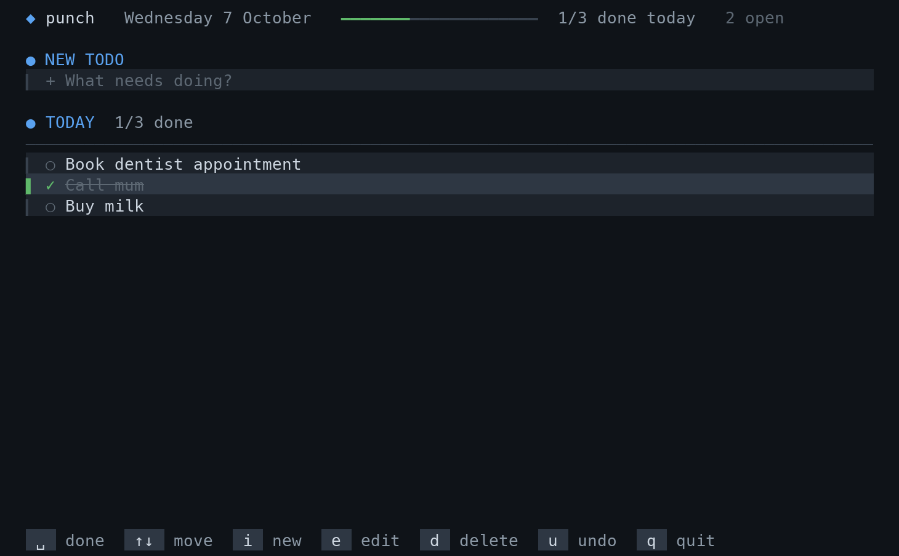

# punch

Your punch list in the terminal: a simple todo list. The input for a new todo sits on top; under it, every todo is
grouped by the day it was added, newest first.



## Install

Needs Node 22.18 or newer, which runs the TypeScript directly. There are no runtime dependencies.

```sh
git clone git@github.com:niklaskors/punch.git
ln -s "$PWD/punch/bin/punch.ts" ~/.local/bin/punch
punch
```

The first time it starts, punch asks where to save your todos:

- **iCloud Drive** (on a Mac): synced across your Macs. Pick it on each Mac and they share one list.
- **This Mac only**: `~/.local/share/punch/todos.json`.
- **Somewhere else**: any folder or `.json` file, e.g. in Dropbox or a git repo.

Run `punch --setup` to choose again; your todos are copied to the new place.

## Themes

`-t night` (default, dark), `-t day` (light terminals) or `-t classic` (16 colours), or set `PUNCH_THEME`.
24-bit colour is used when `$COLORTERM` says so.

## Keys

In the input:

| Key | |
| --- | --- |
| `enter` | add the todo |
| `↓` / `tab` | go to the list |
| `esc` | clear the input |
| `^A` `^E` `^U` `^K` `^W` | the usual line editing |
| `^C` | quit |

In the list:

| Key | |
| --- | --- |
| `↑` `↓` / `k` `j` | move (up from the first todo goes back to the input) |
| `space` / `x` / `enter` | mark as done, or open again |
| `e` | edit the todo in place: `enter` saves, `esc` cancels |
| `d` | delete, `u` to undo |
| `i` / `esc` / `tab` | back to the input |
| `q` | quit |

## Data

Todos are one JSON file, in the place chosen at setup. That choice is kept in `~/.config/punch/config.json`
(or under `$XDG_CONFIG_HOME`). Set `PUNCH_FILE` to use another file regardless.

When iCloud keeps the file only in the cloud ("Optimise Mac Storage"), punch downloads it before starting, so
it never starts from an empty list and overwrites the real one.

## Development

```sh
npm install      # only TypeScript and Node's types, for checking
npm run check    # type-check
npm test
```

## License

MIT
